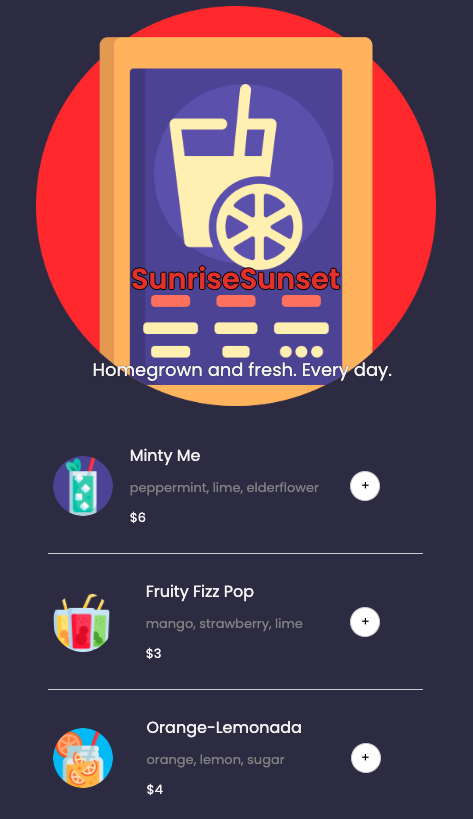
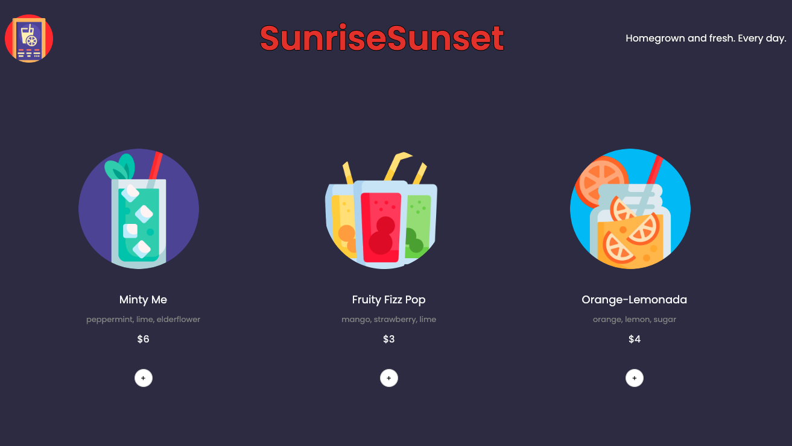

# Juice Shop

### Overview 
A fully responsive restaurant-ordering app made with React. Users can add and remove items and fill out a pay form. The purpose of this project was to practice using React as well as a building a mobile-first design.

### Screenshots

### Features
- Contains logic for a mobile-ordering app: Users can add and remove items to a list by clicking the associated buttons.
- The total score is calculated and displayed as items are added or removed.
- The order button opens up a payment form with required input fields for name, credit card number, and ccv.
- The pay button only functions if inputs are filled in correctly.
- Clicking the pay button brings up a thank you message with the name from the input value, confirming the order.
- The design is made for mobile first but has a desktop design once expanded. 

### Links
- Live URL: (https://juice-ordering-app.netlify.app/)

### Built with
- React
- Vite

### Image Attributions:
- Menu Icons: Freepik.com

### TODOs
Target menu and order items without using data attributes if possible.

